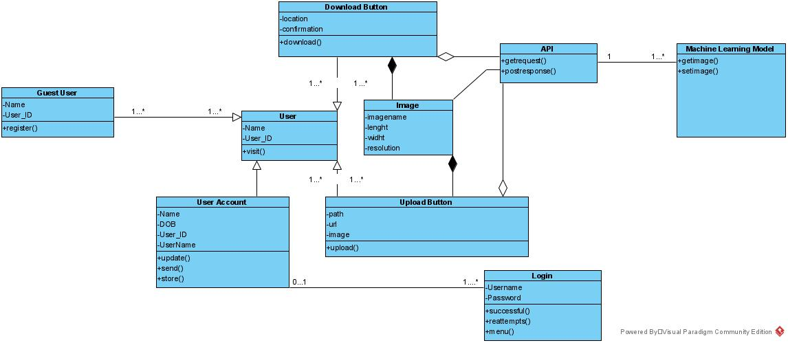
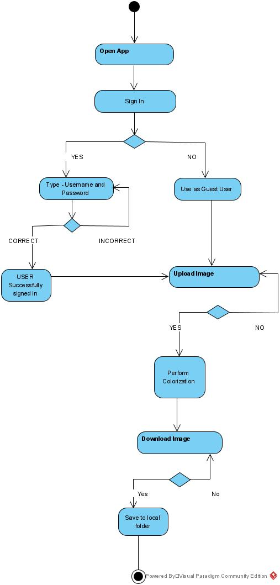
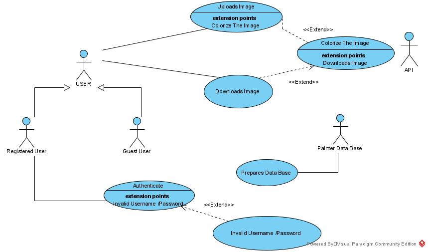
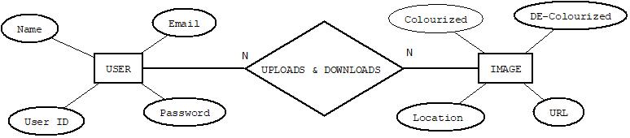
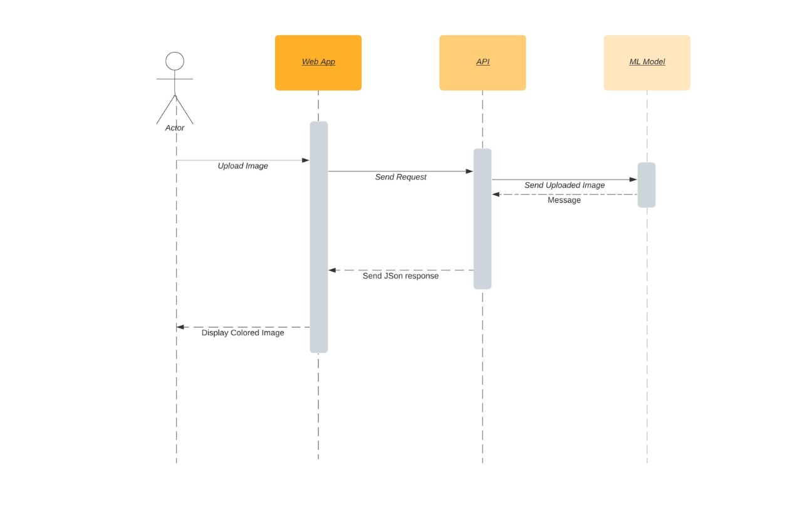

# Painter.ai:
By: Batch 14

 ## Problem Statement 

     To develop a simple and easy to use computerized photo colorizing system
     To develop a computerized photo colorizing system meeting the user interest in restoring old and B&W photograph for research or personal purposes
  
 ## Solution 

     A machine learning based web application that works on API 
     Easy to use web application that simplifies the user’s efforts of restoring or colorizing of B&W photos with one click 
     Easy to upload image through both URL or Local storage device
  
 ## How It Works!
     User visit the site 
     User choses to Sign in or use the application as guest user 
     User uploads image through URL or Local storage device 
     Click on GO 
     Then download the colorized image and can save it to its local storage device 
     
     
 ## Requrirements 
 
    User can be able to create account/register easily by filling all the necessary details. 
    User should be sign successfully by using username and password.
    User will be able to upload images though URL and Local Storage 
    System will allow N no. of users to Use the application N no. of times 
    System will allow user to download the colorized image and save it to local storage 
           
 
  
 ## Artifacts 
  
  ### Class Diagram 
  
  
  
  
  ### Activity Diagram 
  
  
  
  
  ### Use Case Diagrm 
  
  
  
  
  ### ER Diagram 
  
  
  
  
  ### Sequence Diagram 
  
  
  
  
  
  
  ## Built With:

    BOOTSTRAP
   	CSS 
    HTML 
    FLASK 
    SQLAlchemy  

  ## Conclusion 
  We have created a simple to use application for colorizing of B&W photos with the help of CSS, HTML, BOOTSTRAP and FLASK  
  
  ## Authors 
  
    SUJAY AMBERKAR	                   2GI18CS164 
    TANAY SINGH                        2GI18CS167
    TANZEEL ABID KHAN 	           2GI18CS169
    VAISHNAVI TIWARI	           2GI18CS174

  
  
  
 

  
 

Format: 
